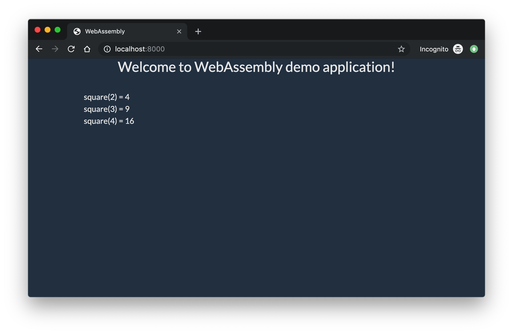
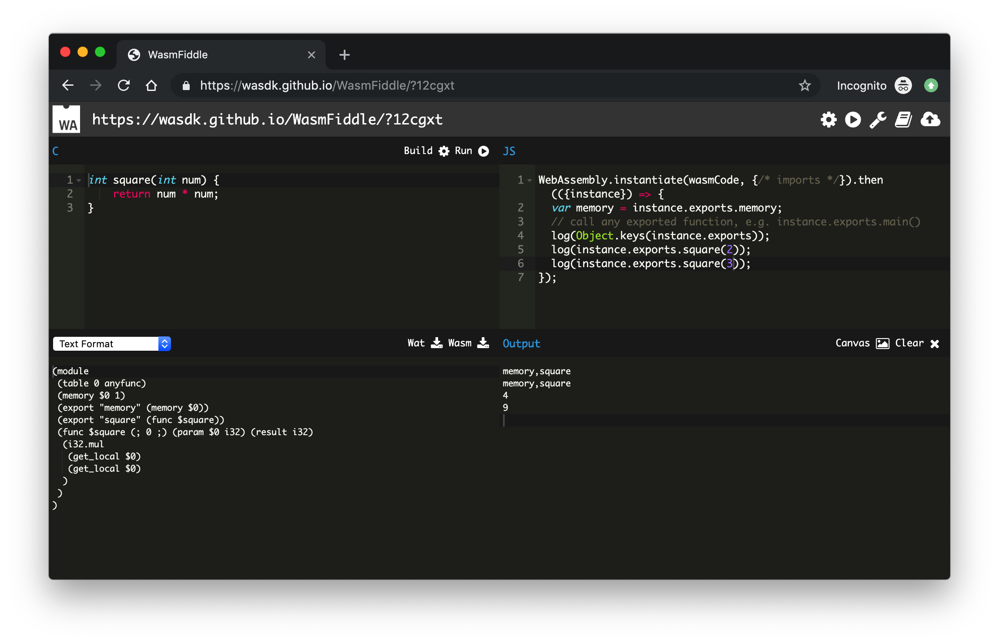

# webassemby-demo
Simple C++ function which can be used in browser.

## Table of contents
* [General info](#general-info)
* [Technologies](#technologies)
* [Features](#features)
* [Screenshots](#screenshots)
* [Setup](#setup)
* [Status](#status)
* [License](#license)

## General info
Goal of project is to learn how to add WebAssembly to website. t uses a very simple C++ function (which takes a number as an argument and returns its square) in a wasm module. This function can be used from JS file.
WebAssemby file was generated with [WasmFiddle](https://wasdk.github.io/WasmFiddle/)

## Technologies
* [WasmFiddle] (https://wasdk.github.io/WasmFiddle/)
* [WasmExplorer](https://mbebenita.github.io/WasmExplorer/)
* [Bootstrap](https://getbootstrap.com/)

## Features
* Count square using WebAssemby module.

## Screenshots

## Setup
How to run this project.

1. Clone this repo

2. To run, go to project folder and run
**Python 2:** python -m SimpleHTTPServer 8000\
**Python 3:** python -m http.server 8000\

3. visit - http://localhost:8000/

## Status
Project is finished.

## License
MIT
